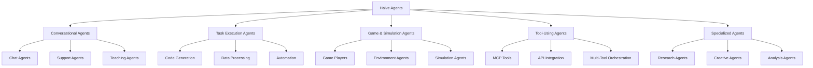

# Haive Agent Documentation Hub

## 🤖 Agent Categories Overview

This document serves as the main entry point for all agent-related documentation. Agents are organized by their primary function and use case.

## 📊 Agent Hierarchy



## 🗂️ Agent Group Documentation

### 1. [Conversational Agents](./CLAUDE_AGENTS_CONVERSATIONAL.md)

**Purpose**: Natural language interaction, dialogue management
**Use Cases**: Customer service, tutoring, companionship
**Key Features**: Context retention, personality, tone management

### 2. [Task Execution Agents](./CLAUDE_AGENTS_TASK.md)

**Purpose**: Completing specific objectives and workflows
**Use Cases**: Code generation, report writing, data analysis
**Key Features**: Goal orientation, step planning, validation

### 3. [Game & Simulation Agents](./CLAUDE_AGENTS_GAMES.md)

**Purpose**: Interacting with game environments and simulations
**Use Cases**: Game playing, strategy development, environment testing
**Key Features**: State tracking, strategy planning, reward optimization

### 4. [Tool-Using Agents](./CLAUDE_AGENTS_TOOLS.md)

**Purpose**: Leveraging external tools and APIs
**Use Cases**: Web scraping, API orchestration, system integration
**Key Features**: Tool selection, parameter mapping, error handling

### 5. [Specialized Agents](./CLAUDE_AGENTS_SPECIALIZED.md)

**Purpose**: Domain-specific expert systems
**Use Cases**: Medical analysis, legal research, scientific computation
**Key Features**: Domain knowledge, specialized reasoning, compliance

## 🚀 Quick Start by Use Case

### "I want to build a chatbot"

→ Start with [Conversational Agents](./CLAUDE_AGENTS_CONVERSATIONAL.md)

### "I need to automate a workflow"

→ See [Task Execution Agents](./CLAUDE_AGENTS_TASK.md)

### "I'm building a game AI"

→ Check [Game & Simulation Agents](./CLAUDE_AGENTS_GAMES.md)

### "I need to integrate with external services"

→ Read [Tool-Using Agents](./CLAUDE_AGENTS_TOOLS.md)

### "I have a specialized domain problem"

→ Explore [Specialized Agents](./CLAUDE_AGENTS_SPECIALIZED.md)

## 📋 Common Agent Patterns

### 1. **Single-Purpose Agent**

```python
from haive.agents import BaseAgent

class SimpleAgent(BaseAgent):
    """Focused on one specific task."""

    async def run(self, input: str) -> str:
        # Direct task execution
        return await self.process(input)
```

### 2. **Multi-Step Agent**

```python
class MultiStepAgent(BaseAgent):
    """Breaks down complex tasks into steps."""

    async def run(self, input: str) -> str:
        plan = await self.plan_steps(input)
        results = []
        for step in plan:
            result = await self.execute_step(step)
            results.append(result)
        return self.summarize_results(results)
```

### 3. **Tool-Orchestration Agent**

```python
class ToolAgent(BaseAgent):
    """Coordinates multiple tools."""

    async def run(self, input: str) -> str:
        tools_needed = await self.identify_tools(input)
        results = {}
        for tool in tools_needed:
            results[tool] = await self.use_tool(tool, input)
        return await self.combine_results(results)
```

## 🏗️ Agent Development Workflow

1. **Identify Agent Type** → Choose from categories above
2. **Read Group Documentation** → Follow specific patterns
3. **Use Standard Template** → See [CLAUDE_AGENT_TEMPLATE.md](./CLAUDE_AGENT_TEMPLATE.md)
4. **Implement Core Logic** → Follow examples in group docs
5. **Add Tests** → Use `poetry run pytest`
6. **Document** → Update relevant group documentation

## 🧪 Testing Agents

```bash
# Run all agent tests
poetry run pytest packages/haive-agents/tests/

# Run specific agent group tests
poetry run pytest packages/haive-agents/tests/test_conversational.py

# Run with debugging
poetry run pytest -xvs packages/haive-agents/tests/test_your_agent.py
```

## 📊 Agent Performance Metrics

### Key Metrics to Track

1. **Response Time**: Target < 2s for conversational, < 30s for complex tasks
2. **Token Usage**: Monitor input/output tokens
3. **Success Rate**: Task completion percentage
4. **Error Rate**: Failed operations tracking
5. **User Satisfaction**: Feedback scores

### Monitoring Example

```python
from haive.monitoring import AgentMonitor

monitor = AgentMonitor(agent_name="your_agent")
with monitor.track_performance():
    result = await agent.run(input)
    monitor.log_success(result)
```

## 🔧 Agent Configuration

### Standard Configuration Structure

```python
agent_config = {
    "name": "agent_name",
    "type": "conversational|task|game|tool|specialized",
    "model": {
        "provider": "openai|anthropic|local",
        "name": "gpt-4|claude-3|llama",
        "temperature": 0.7,
        "max_tokens": 2000
    },
    "tools": ["tool1", "tool2"],
    "memory": {
        "type": "conversation_buffer|summary|vector",
        "size": 1000
    },
    "behaviors": {
        "retry_on_error": True,
        "max_retries": 3,
        "timeout": 30
    }
}
```

## 🌟 Best Practices

1. **Start Simple** - Begin with basic agent, add complexity gradually
2. **Use Existing Patterns** - Don't reinvent the wheel
3. **Test Thoroughly** - Include edge cases and error scenarios
4. **Document Intent** - Explain why, not just what
5. **Monitor Performance** - Track metrics from day one
6. **Version Control** - Track agent configurations

## 📚 Additional Resources

- **Agent Showcase**: `/docs/source/agents/showcase.rst`
- **API Reference**: `/docs/source/api/agents.rst`
- **Examples**: `/packages/haive-agents/examples/`
- **Templates**: `/CLAUDE_AGENT_TEMPLATE.md`

## 🤝 Contributing

To add new agent types or improve documentation:

1. Follow [DOCUMENTATION_STANDARDS.md](./DOCUMENTATION_STANDARDS.md)
2. Update relevant group documentation
3. Add examples and test cases
4. Submit PR with clear description

---

**Navigation**: Return to [CLAUDE.md](./CLAUDE.md) | View [All Agent Groups](#agent-group-documentation)
