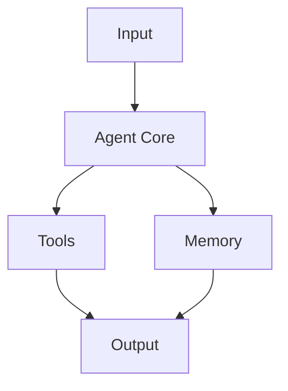

# Haive Documentation Standards & Conventions

## 📐 Documentation Hierarchy

### Level 1: Professional Documentation (User-Facing)

- **Purpose**: API references, user guides, integration documentation
- **Location**: `/docs/source/`
- **Format**: Sphinx RST or MyST Markdown
- **Tone**: Professional, complete sentences, formal
- **Review**: Required before release

### Level 2: Developer Documentation (Team-Facing)

- **Purpose**: Technical specs, architecture decisions, implementation details
- **Location**: `/project_docs/` or package-specific docs
- **Format**: Markdown
- **Tone**: Technical but clear, can be less formal
- **Review**: Peer review recommended

### Level 3: Working Notes (Individual-Facing)

- **Purpose**: Quick notes, TODOs, experimental ideas
- **Location**: Designated sections or clearly marked
- **Format**: Markdown or plain text
- **Tone**: Informal, can be incomplete
- **Review**: Not required

## 📝 Standard Templates

### 1. Agent Documentation Template

````markdown
# Agent: [Agent Name]

## Overview

Brief description of what this agent does and its primary use case.

## Key Features

- Feature 1: Description
- Feature 2: Description
- Feature 3: Description

## Architecture


````

## Configuration

```python
# Example configuration
agent_config = {
    "model": "gpt-4",
    "temperature": 0.7,
    "tools": ["web_search", "calculator"],
    "memory_type": "conversation_buffer"
}
```

## Usage Examples

### Basic Usage

```python
poetry run python -m haive.agents.your_agent
```

### Advanced Usage

```python
from haive.agents import YourAgent

agent = YourAgent(config=agent_config)
response = await agent.run("Your prompt here")
```

## API Reference

Link to detailed API documentation in `/docs/source/api/`

## Testing

```bash
poetry run pytest packages/haive-agents/tests/test_your_agent.py
```

## Performance Considerations

- Memory usage: ~X MB
- Response time: ~Y seconds
- Token usage: ~Z per request

## Related Documentation

- [General Agent Guide](./CLAUDE_AGENTS.md)
- [Agent API Reference](/docs/source/api/agents.rst)
- [Testing Guide](./QUICK_TEST.md)

````

### 2. Quick Guide Template
```markdown
# Quick Guide: [Topic]

## What You'll Learn
In 5 minutes, you'll be able to:
- [ ] Task 1
- [ ] Task 2
- [ ] Task 3

## Prerequisites
- Poetry installed
- Haive environment set up
- Basic Python knowledge

## Step-by-Step

### Step 1: [Action]
```bash
poetry run command
````

Expected output: ...

### Step 2: [Action]

```python
# Code example
```

### Step 3: [Action]

Description of manual steps or verification

## Troubleshooting

### Common Issue 1

**Problem**: Description
**Solution**: Steps to fix

### Common Issue 2

**Problem**: Description
**Solution**: Steps to fix

## Next Steps

- Link to more detailed guide
- Related topics to explore

````

### 3. Package README Template
Already exists at `/docs/source/_templates/module_readme_template.md`

## 🎨 Formatting Standards

### Code Examples
1. **Always use poetry run** in command examples
2. **Include imports** in Python examples
3. **Add type hints** for clarity
4. **Provide expected output** when helpful

### Good Example:
```python
from typing import List, Dict
from haive.agents import BaseAgent

async def create_agent(config: Dict[str, any]) -> BaseAgent:
    """Create and configure an agent instance.

    Args:
        config: Agent configuration dictionary

    Returns:
        Configured agent instance
    """
    agent = BaseAgent(config)
    return agent
````

### Headings

- **H1 (#)**: Document title only
- **H2 (##)**: Major sections
- **H3 (###)**: Subsections
- **H4 (####)**: Sub-subsections (rarely needed)

### Lists

- Use **bullet points** for unordered items
- Use **numbers** for sequential steps
- Use **task lists** for actionable items

## 🏷️ Documentation Categories

### By Document Type

1. **API_REFERENCE**: Technical API documentation
2. **USER_GUIDE**: End-user focused guides
3. **DEVELOPER_NOTES**: Technical implementation details
4. **QUICK_START**: Rapid onboarding guides
5. **ARCHITECTURE**: System design documentation

### By Maturity Level

1. **STABLE**: Production-ready, fully reviewed
2. **BETA**: Functional but may change
3. **DRAFT**: Work in progress
4. **DEPRECATED**: Outdated, marked for removal

## 📋 File Naming Conventions

### Documentation Files

- **Guides**: `GUIDE_[TOPIC].md` (e.g., `GUIDE_WEBSOCKET.md`)
- **Quick Refs**: `QUICK_[TOPIC].md` (e.g., `QUICK_TEST.md`)
- **Agent Docs**: `CLAUDE_AGENTS_[GROUP].md`
- **Templates**: `TEMPLATE_[TYPE].md`

### Code Documentation

- **Module Docs**: `README.md` in package root
- **API Docs**: `{module_name}.rst` in `/docs/source/api/`
- **Examples**: `example_{feature}.py` in `/examples/`

## ✅ Documentation Checklist

### Before Creating New Documentation

- [ ] Check if similar documentation exists
- [ ] Determine appropriate level (1, 2, or 3)
- [ ] Choose correct template
- [ ] Select proper location

### While Writing

- [ ] Follow the appropriate template
- [ ] Use consistent formatting
- [ ] Include working examples
- [ ] Add links to related docs
- [ ] Use poetry run in commands

### After Writing

- [ ] Spell check and grammar review
- [ ] Test all code examples
- [ ] Verify all links work
- [ ] Add to CLAUDE.md routing if needed
- [ ] Update any indexes or tables of contents

## 🔄 Maintenance Guidelines

### Regular Reviews

- **Monthly**: Check for outdated examples
- **Quarterly**: Review and update API docs
- **On Change**: Update affected documentation immediately

### Version Control

- **Commit Message**: "docs: [type] update [topic]"
- **Branch Naming**: `docs/update-[topic]`
- **PR Description**: List all documentation changes

## 🚫 Common Mistakes to Avoid

1. **Don't mix documentation levels** in the same file
2. **Don't use relative imports** in examples
3. **Don't forget poetry run** in commands
4. **Don't leave TODOs** in Level 1 documentation
5. **Don't create duplicate documentation**
6. **Don't use inconsistent formatting**

## 🏆 Best Practices

1. **Write for your audience** - developers vs users
2. **Show, don't just tell** - include examples
3. **Keep it current** - update with code changes
4. **Be concise** - avoid unnecessary verbosity
5. **Cross-reference** - link related documentation
6. **Test everything** - ensure examples work

## 📊 Documentation Metrics

Track these to ensure quality:

- **Completeness**: All public APIs documented
- **Currency**: Last update date < 3 months
- **Clarity**: Examples for every feature
- **Accessibility**: Proper navigation and search

---

Remember: Good documentation is an investment that pays dividends in reduced support time and happier users.
